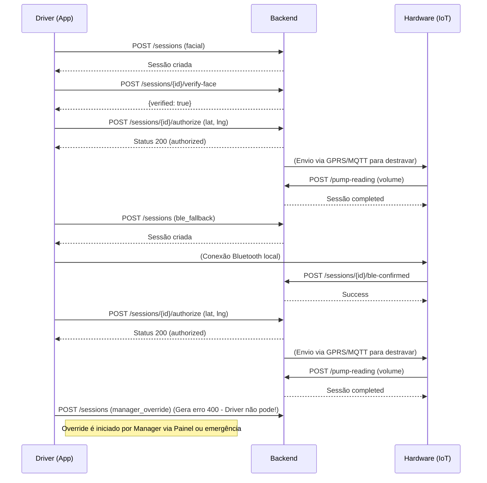

# API de Integração (Mobile e Hardware)
Verificado contra o commit 6eed85a42567e181b977c76ce92875eb41e80afa

Este documento descreve as rotas, os limites e os payloads utilizados pelo App Mobile do Motorista e pelo Hardware IoT do caminhão. A API utiliza tokens JWT para as rotas do motorista e uma chave estática (`x-api-key`) para a rota do hardware.

**LGPD**: Nenhuma imagem ou foto é salva em disco ou no banco. O servidor salva apenas um log (metadados de tentativas) na tabela `facial_attempts` para retenção por 90 dias.

## Autenticação do Motorista

### `POST /api/auth/driver/login`
Autentica o motorista e devolve os dados do caminhão vinculado.

**Requisição (Body):**
```json
{
  "email": "joao@ehr.com",
  "password": "senha"
}
```

**Respostas:**
- **200 OK**:
  ```json
  {
    "token": "eyJhbG...",
    "driver": {
      "id": 1,
      "name": "João",
      "email": "joao@ehr.com",
      "phone": "999999"
    },
    "vehicle": {
      "id": 10,
      "plate": "ABC-1234",
      "model": "Volvo FH",
      "brand": "Volvo",
      "capacity": "450.00"
    }
  }
  ```
  O `token` do motorista tem validade padrão de 30 dias.
- **401 Unauthorized**: `{ "error": "Credenciais inválidas" }` (Mesmo erro se a senha estiver incorreta ou se o motorista estiver inativo/deactivated antes do login).

## Rotas de Abastecimento do App (Autenticadas com JWT do Motorista)

O App Mobile nunca envia o nível de combustível ou decide o volume. O App também nunca deve enviar `release_method: "manager_override"`. Os métodos suportados pelo app são `'facial'` e `'ble_fallback'`.

### `POST /api/fueling/sessions`
Cria uma nova sessão (status `requested`).

**Requisição (Body):**
```json
{
  "truck_id": 10,
  "release_method": "facial"
}
```

**Respostas:**
- **201 Created**: Devolve a sessão criada, exemplo: `{ "id": 5, "status": "requested", "release_method": "facial", ... }`
- **400 Bad Request**: `{ "error": "Caminhão não enviado ou método inválido" }` ou `{ "error": "O app não pode iniciar um override do gestor" }` (se enviar `manager_override`).
- **403 Forbidden**: `{ "error": "Acesso desativado. Contate o gestor." }` (se o motorista foi desativado pós-login).
- **409 Conflict**: `{ "error": "Já existe uma sessão ativa ou solicitada para este caminhão" }`

### `POST /api/fueling/sessions/:id/verify-face`
Valida a foto do motorista com a biometria cadastrada.

**Requisição (Body):**
```json
{
  "image_base64": "iVBORw0KGgo..." // Base64 puro, sem o prefixo "data:image/jpeg;base64,"
}
```

**Respostas:**
- **200 OK (Verificado)**: `{ "verified": true }`
- **200 OK (Não reconhecido)**: `{ "verified": false, "attempts": 1, "attempts_left": 2 }`
- **400 Bad Request**: `{ "error": "Formato de imagem inválido..." }` (ou tamanho excede 2MB).
- **403 Forbidden**: `{ "error": "Sessão de outro motorista" }`
- **404 Not Found**: `{ "error": "Sessão não encontrada ou não está em fase de requisição" }`
- **409 Conflict**: `{ "error": "Motorista não tem rosto cadastrado" }` ou `{ "error": "Sessão já possui biometria validada" }`
- **429 Too Many Requests**: `{ "error": "Limite de tentativas faciais excedido para esta sessão" }` ou `{ "error": "Limite de requisições excedido. Tente novamente mais tarde." }` (10/hora).
- **503 Service Unavailable**: `{ "error": "Serviço de reconhecimento facial indisponível." }`

### `POST /api/fueling/sessions/:id/authorize`
O app chama este endpoint para autorizar a trava via GPRS.

**Requisição (Body):**
```json
{
  "lat": -23.550520,
  "lng": -46.633308
}
```

**Respostas:**
- **200 OK**: `{ "id": 5, "status": "authorized" }`
- **400 Bad Request**: `{ "error": "Localização do app é obrigatória." }`
- **403 Forbidden**: 
  - `{ "error": "Validação facial obrigatória para o método facial" }`
  - `{ "error": "A validação facial expirou (tempo limite de 2 minutos)" }`
  - `{ "error": "Esta validação facial já foi consumida" }`
  - `{ "error": "Confirmação do hardware pendente para usar BLE" }`
  - `{ "error": "A confirmação BLE expirou (tempo limite de 2 minutos)" }`
  - `{ "error": "Esta confirmação BLE já foi usada" }`
  - `{ "error": "Motorista não tem permissão para autorizar manager_override" }`
  - `{ "error": "Caminhão está fora da cerca de abastecimento (... km de distância)" }`
- **409 Conflict**: `{ "error": "Sessão já foi processada" }`

### `POST /api/fueling/sessions/:id/facial-failure`
App reporta falha severa na câmera/captura.
**Respostas**: 200 OK. 403 (Sessão de outro motorista). 404.

### `POST /api/fueling/sessions/:id/finish`
O motorista encerra o processo via App antes do timeout. O caminhão **não** tem o nível atualizado (a API aguarda a telemetria do IoT). A sessão é marcada como `unverified` e um alerta de `unverified_fueling` é gerado.
**Respostas**: 200 OK. 403, 404, 409 (se já estiver completada).

### `GET /api/fueling/sessions/:truckId/active`
Busca sessão `authorized` para manter tela de abastecimento viva.

## Rotas do Hardware IoT (Protegidas por `x-api-key`)

### `POST /api/fueling/sessions/:id/ble-confirmed`
O hardware confirma que a bomba foi emparelhada via Bluetooth (quando o método é `ble_fallback`).

**Header Obrigatório**: `x-api-key: SEGREDO_DO_HARDWARE`

**Respostas:**
- **200 OK**: `{ "success": true }`
- **403 Forbidden**: `{ "error": "Hardware key inválida" }` ou `{ "error": "Sessão pertence a outro caminhão" }`
- **404 Not Found**: `{ "error": "Sessão não encontrada ou não está em requisição" }`
- **409 Conflict**: `{ "error": "Método de liberação não é ble_fallback" }`

### `POST /api/fueling/pump-reading`
A placa IoT envia a leitura de volume após fechar a válvula. Atualiza o nível do tanque, marca a sessão como `completed` e cria um `fueling_logs`.

**Header Obrigatório**: `x-api-key: SEGREDO_DO_HARDWARE`
**Requisição (Body):**
```json
{
  "truck_id": 10,
  "pump_liters": 150.5
}
```
**Respostas:**
- **200 OK**: `{ "success": true, "volume_liters": 150.5, "duration_minutes": "2.5" }`
- **400 Bad Request**: `{ "error": "truck_id e pump_liters (número positivo) são obrigatórios" }` ou `{ "error": "O volume abastecido excede a capacidade total do tanque" }`
- **403 Forbidden**: `{ "error": "Hardware key inválida" }`
- **404 Not Found**: `{ "error": "Caminhão não encontrado" }`
- **409 Conflict**: `{ "error": "Nenhuma sessão 'active' ou 'completed' recente encontrada para este caminhão" }`

## Configurações / Constantes
- **SESSION_TTL_MIN**: Fixo em 30 minutos no código (uma rotina encerra sessões expiradas).
- **Tempo para consumir validação facial/BLE**: Fixo em 2 minutos.
- **Limites de Rate Limit**: 3 por sessão e 10 por hora (fixos no código).
- **Variáveis de Ambiente**:
  - `FACE_PROVIDER`: `rekognition` ou `mock` (se vazio, as rotas faciais devolvem erro 503). O `mock` é recusado caso `NODE_ENV=production`.
  - `FACE_MATCH_THRESHOLD`: Define a confiança mínima aceita (padrão 0.90).
  - `FACIAL_MAX_ATTEMPTS`: Padrão 3 tentativas.
  - `FACIAL_ATTEMPTS_RETENTION_DAYS`: Padrão de 90 dias para apagar os metadados antigos.
  - `GEOFENCE_KM`: Distância máxima tolerada entre o caminhão e o App no `authorize` (padrão 0.2 km).

## Socket.IO
Todas as conexões via Socket.IO requerem envio de um token JWT válido na propriedade `auth: { token: '...' }` do handshake.

**Eventos Emitidos pela API:**
- `newAlert`: Disparado quando um novo alerta de segurança ou divergência é criado.
- `fleetUpdate`: Envia um snapshot atualizado de todos os caminhões e níveis.
- `fuelingSessionUpdate`: Atualiza o painel quando a sessão muda de estado (ex: `authorized`, `completed`).
- `liveEventsUpdate`: Dados crus de telemetria simulada.
- `emergencyUnlockRequest`: Disparado ao painel web quando o App ou o hardware solicia override emergencial, pedindo confirmação de um Gestor.

## Diagramas de Fluxo


