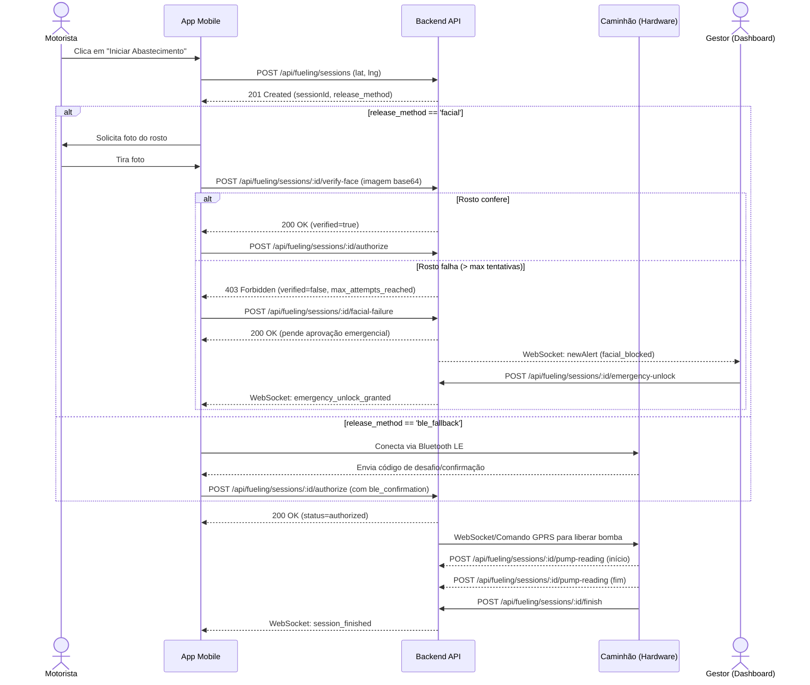

# Documentação da API Mobile (App do Motorista)

Este documento descreve os endpoints da API que devem ser consumidos pelo aplicativo mobile dos motoristas para interagir com o sistema de gestão de frotas EHR Solutions. A API utiliza JWT para autenticação.

## 1. Fluxo de Abastecimento (Diagrama)

Abaixo está o fluxo completo de um abastecimento integrado com o reconhecimento facial, a validação via Bluetooth (BLE) e a liberação de emergência (Override).



## 2. Endpoints de Autenticação e Conta

### 2.1 Login do Motorista
- **Método**: `POST`
- **Rota**: `/api/auth/driver/login`
- **Body**:
  ```json
  {
    "email": "motorista@ehr.com",
    "password": "senha"
  }
  ```
- **Resposta Sucesso (200)**:
  ```json
  {
    "token": "eyJhb...",
    "driver": { "id": 1, "name": "João", "email": "motorista@ehr.com", "phone": "..." },
    "vehicle": { "id": 1, "plate": "ABC-1234", "model": "Volvo", "capacity": "500.00" }
  }
  ```

---

## 3. Endpoints de Abastecimento

Todas as rotas abaixo requerem o header `Authorization: Bearer <token>`.

### 3.1 Solicitar Nova Sessão
- **Método**: `POST`
- **Rota**: `/api/fueling/sessions`
- **Body**:
  ```json
  {
    "truck_id": 1,
    "lat": -23.5505,
    "lng": -46.6333,
    "release_method": "facial"
  }
  ```
  *(O `release_method` deve ser 'facial' ou 'ble_fallback')*
- **Resposta Sucesso (201)**: Retorna os dados da sessão criada (status `requested`).

### 3.2 Validação Facial (quando aplicável)
- **Método**: `POST`
- **Rota**: `/api/fueling/sessions/:sessionId/verify-face`
- **Body**:
  ```json
  {
    "image": "data:image/jpeg;base64,/9j/4AAQSk..."
  }
  ```
- **Respostas**:
  - `200 OK`: `{"success":true, "verified":true, "confidence":98.5}` (Pronto para autorizar)
  - `403 Forbidden`: `{"error":"Face not matched", "verified":false, "attempts_left":2}`
  - `403 Forbidden`: Se as tentativas se esgotarem (retorna `max_attempts_reached`).

### 3.3 Reportar Falha Facial Definitiva
Quando o motorista esgota as tentativas ou a câmera quebra, ele pode solicitar liberação emergencial do gestor.
- **Método**: `POST`
- **Rota**: `/api/fueling/sessions/:sessionId/facial-failure`
- **Body**:
  ```json
  {
    "reason": "max_attempts_reached" // ou "camera_broken", "network_error"
  }
  ```
- **Resposta (200)**: Altera a sessão para aguardar o override do gestor.

### 3.4 Autorizar Sessão (Abrir a Bomba)
Após a biometria ser aprovada, ou recebendo a confirmação BLE, o motorista chama este endpoint.
- **Método**: `POST`
- **Rota**: `/api/fueling/sessions/:sessionId/authorize`
- **Body (para BLE Fallback)**:
  ```json
  {
    "ble_confirmation": "codigo_recebido_do_caminhao"
  }
  ```
  *(Se for facial, o body pode ser vazio)*
- **Resposta (200)**: O status da sessão muda para `authorized` e o comando GPRS é disparado.
- **Erros**: `403` se a biometria não tiver sido validada, ou se o token BLE for inválido/expirado.

### 3.5 Consultar Status da Sessão Ativa
- **Método**: `GET`
- **Rota**: `/api/fueling/sessions/:truckId/active`
- **Resposta (200)**: Retorna o objeto da sessão atual do caminhão.

---

## 4. WebSockets
O App Mobile deve se conectar via Socket.IO para receber atualizações em tempo real:
- **Conexão**: Passar o JWT no handshake (`auth: { token: "..." }`).
- **Eventos Recebidos**:
  - `fuelingSessionUpdate`: Recebe atualizações de status (ex: quando o gestor aprova um *emergency unlock*, ou a bomba termina de abastecer).
  - `truck_deactivated`: Quando o gestor desvincula/desativa o motorista de emergência.

## 5. Limitações e Regras de Negócio
- Motoristas **não** podem solicitar sessões com o método `manager_override`.
- Se o motorista for desativado no painel, seu JWT se tornará inválido imediatamente na próxima requisição (validação de banco em tempo real).
- Senhas e dados biométricos (`face_template_ref`) **nunca** trafegam em plain-text nem são retornados em listagens.
