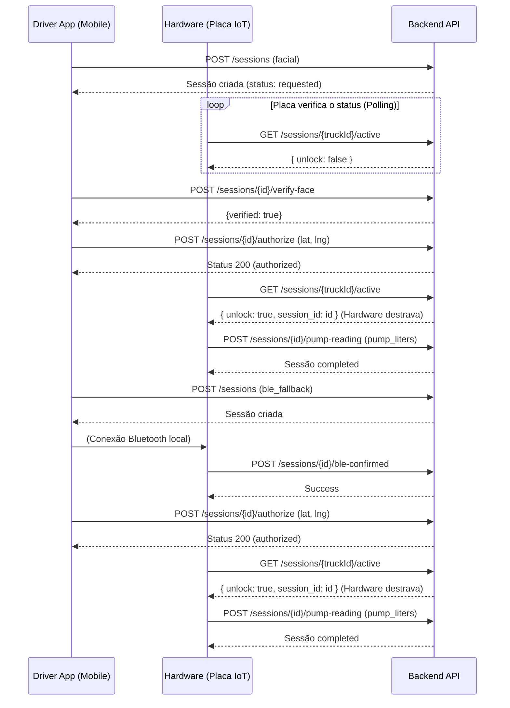

Verificado contra o commit 6eed85a42567e181b977c76ce92875eb41e80afa

# EHR Solutions - Documentação da API Mobile & Hardware

Este documento especifica as rotas expostas para o App Mobile (Motorista) e a comunicação com a Placa IoT (Hardware).

## Autenticação e Erros Comuns

O backend utiliza middlewares específicos para validar quem está chamando a rota.

### Hardware (Placa IoT)
Rotas do hardware exigem o envio de um header `x-api-key`.
- **401 Unauthorized**: `{ "error": "Invalid Hardware API Key" }` (Chave não cadastrada).

### App do Motorista
Rotas exclusivas do motorista exigem o envio do token no header `Authorization: Bearer <token>`.
- **401 Unauthorized**: `{ "error": "Driver Authorization token missing or invalid" }` ou `{ "error": "Invalid or expired driver token" }`
- **403 Forbidden**: `{ "error": "Forbidden: Drivers only" }`
- **403 Forbidden**: `{ "error": "driver_inactive" }` (Ocorre se o motorista for desativado pelo painel *após* o login. A rota será bloqueada).

### Erros Globais (Dash/Misto)
Em rotas que aceitam múltiplos atores (`authAny`), gestores recebem:
- **401 Unauthorized**: `{ "error": "Authorization token missing or invalid" }`, `{ "error": "Invalid or expired token" }`, `{ "error": "User not found" }` ou `{ "error": "User is deactivated" }`
- **403 Forbidden**: `{ "error": "Acesso restrito ao app do motorista" }` (gestor chamando rota de driver), `{ "error": "Acesso negado para motoristas" }` (driver chamando rota de gestor) ou `{ "error": "forbidden_role" }` (auditor tentando alterar algo).
- **400 Bad Request**: Erros do `express-validator` respondem no formato `{ "errors": [...] }`.

---

## 1. Login do Motorista

### `POST /api/auth/driver/login`
Autentica o motorista, devolvendo o token JWT e dados do caminhão atualmente vinculado (se houver).

**Requisição (Body):**
```json
{
  "email": "motorista@ehr.com",
  "password": "senha"
}
```

**Respostas:**
- **200 OK**:
  ```json
  {
    "token": "eyJhbGciOi...",
    "driver": {
      "id": 1,
      "name": "João",
      "email": "joao@ehr.com",
      "phone": "999999999"
    },
    "vehicle": {
      "id": 5,
      "plate": "ABC-1234",
      "model": "Volvo FH",
      "brand": "Volvo",
      "capacity": 500
    }
  }
  ```
  *(Nota: o token tem validade de 30d).*
- **400 Bad Request**: Se `email` ou `password` não forem informados.
- **401 Unauthorized**: `{ "error": "Credenciais inválidas" }` (Senha incorreta, email inexistente, ou motorista com `is_active` = `false`).

---

## 2. Fluxo de Abastecimento

### `POST /api/fueling/sessions`
Inicia um processo de abastecimento. Pode ser invocado por motorista ou gestor.

**Requisição (Body):**
```json
{
  "truck_id": 10,
  "release_method": "facial",
  "lat": -23.550520,
  "lng": -46.633308
}
```
*(Valores de `release_method`: `facial` ou `ble_fallback`. Se o app tentar usar `manager_override`, o servidor recusará. Gestores iniciam a sessão via Dashboard)*.

**Respostas:**
- **201 Created**:
  ```json
  {
    "id": 5,
    "truck_id": 10,
    "driver_id": 2,
    "station_id": 1,
    "status": "requested",
    "release_method": "facial",
    "requested_at": "2026-10-09T12:00:00.000Z"
  }
  ```
- **400 Bad Request**: `{ "error": "truck_id é obrigatório" }` ou `{ "error": "invalid_release_method" }` (se o motorista tentar algo que não seja facial ou ble_fallback).
- **403 Forbidden**: `{ "error": "Este caminhão não está vinculado a você" }`
- **404 Not Found**: `{ "error": "Caminhão não encontrado" }`
- **409 Conflict**: `{ "error": "Já existe uma sessão ativa para este caminhão", "session": { ... }, "session_id": 3 }`

---

### `POST /api/fueling/sessions/:id/verify-face`
Valida a foto do motorista com a biometria cadastrada. Rota exclusiva do motorista.

**Requisição (Body):**
```json
{
  "image_base64": "iVBORw0KGgo..." 
}
```
*(Base64 puro, JPEG ou PNG de até 2 MB, sem o prefixo `data:image/jpeg;base64,`)*.

**Respostas:**
- **200 OK (Sucesso)**: `{ "verified": true }`
- **200 OK (Falha biométrica)**: `{ "verified": false, "attempts": 2, "attempts_left": 1 }`
- **400 Bad Request**: `{ "error": "image_base64 é obrigatório" }` ou mensagens base do validador (ex: `"Formato de imagem inválido (permitido: jpg, png) ou tamanho excede 2MB"`).
- **403 Forbidden**: `{ "error": "Sessão de outro motorista" }`
- **404 Not Found**: `{ "error": "Sessão não encontrada" }`
- **409 Conflict**: `{ "error": "face_not_enrolled" }`
- **429 Too Many Requests**: `{ "error": "Limite de tentativas por hora atingido." }` ou `{ "error": "Limite de tentativas da sessão atingido." }`
- **503 Service Unavailable**: `{ "error": "face_provider_unavailable" }`

---

### `POST /api/fueling/sessions/:id/authorize`
O app chama este endpoint para autorizar a trava final. A localização (lat, lng) no corpo é opcional. A cerca de segurança (geofence) sempre será conferida contra o posto (`station`) da sessão.

**Requisição (Body):**
```json
{
  "lat": -23.550520,
  "lng": -46.633308
}
```

**Respostas:**
- **200 OK**: Retorna o corpo completo atualizado da sessão (status `"authorized"`).
- **403 Forbidden**:
    - `{ "error": "Sessão pertence a outro motorista" }`
    - `{ "error": "driver_cannot_use_manager_override" }`
    - `{ "error": "facial_verification_already_used" }`
    - `{ "error": "facial_verification_required" }`
    - `{ "error": "facial_verification_expired" }`
    - `{ "error": "ble_confirmation_required" }`
    - `{ "error": "ble_confirmation_already_used" }`
    - `{ "error": "ble_confirmation_expired" }`
    - `{ "error": "Caminhão fora da área do posto autorizado. Tentativa bloqueada e alertada." }`
- **404 Not Found**: `{ "error": "Sessão não encontrada ou já autorizada" }`
- **409 Conflict**: `{ "error": "Sessão já foi processada" }`

---

### `POST /api/fueling/sessions/:id/facial-failure`
App reporta falha severa na câmera/captura. (Motorista)

**Respostas:**
- **200 OK**: `{ "attempts": 1, "max_attempts": 3, "remaining": 2, "needs_manager": false }`
- **403 Forbidden**: `{ "error": "Sessão pertence a outro motorista" }`
- **404 Not Found**: `{ "error": "Sessão não encontrada ou já processada" }`

---

### `POST /api/fueling/sessions/:id/finish`
Chamado para encerrar manualmente uma sessão (Qualquer ator).

**Nota de Semântica:** Se chamado pelo Motorista, o sistema marcará o abastecimento como `unverified` e criará um alerta `unverified_fueling`, sem alterar o nível do caminhão. (Atualizações de nível são exclusivas do hardware).

**Respostas:**
- **200 OK**: Retorna o log final salvo (`fueling_logs`).
- **403 Forbidden**: `{ "error": "Sem permissão para esta sessão" }`
- **404 Not Found**: `{ "error": "Sessão não encontrada ou não está ativa" }` ou `{ "error": "Caminhão não encontrado" }`

---

## 3. Hardware (Placa IoT)

A placa comunica-se com a API utilizando o cabeçalho `x-api-key`.

### `GET /api/fueling/sessions/:truckId/active`
A placa IoT faz chamadas contínuas (polling) para esta rota. É o mecanismo de destravamento: quando `unlock=true`, a válvula deve ser aberta. Aceita hardware ou app.

**Respostas:**
- **200 OK (Para Hardware)**: `{ "unlock": true, "session_id": 5, "status": "authorized", "expires_at": "..." }`
- **200 OK (Para App)**: Devolve o objeto completo da sessão, ou `null`.
- **400 Bad Request**: `{ "error": "truckId inválido" }`
- **403 Forbidden**: `{ "error": "API Key não pertence a este caminhão" }` (hardware) ou `{ "error": "Este caminhão não está vinculado a você" }` (motorista).

---

### `POST /api/fueling/sessions/:id/ble-confirmed`
O hardware avisa o servidor que pareou com o app mobile do motorista.

**Respostas:**
- **200 OK**: `{ "success": true }`
- **403 Forbidden**: `{ "error": "Esta sessão pertence a outro caminhão" }`
- **409 Conflict**: `{ "error": "Sessão não encontrada ou não aguardando" }` ou `{ "error": "Sessão não usa BLE fallback" }`

---

### `POST /api/fueling/sessions/:id/pump-reading`
A placa envia a leitura de volume após fechar a válvula. Atualiza o nível do tanque e marca a sessão como `completed`.

**Requisição (Body):**
```json
{
  "pump_liters": 150.5
}
```

**Respostas:**
- **200 OK**: `{ "success": true, "pump_liters": 150.5 }`
- **400 Bad Request**: `{ "error": "pump_liters é obrigatório e numérico" }` ou `{ "error": "pump_liters inválido (fora do limite da capacidade)" }`
- **403 Forbidden**: `{ "error": "Hardware API Key não pertence a este caminhão" }`
- **404 Not Found**: `{ "error": "Sessão não encontrada" }`
- **409 Conflict**: `{ "error": "Sessão não está ativa nem concluída" }`

---

## Configurações / Constantes
- **SESSION_TTL_MIN**: Fixo em 30 minutos no código (uma rotina encerra sessões expiradas).
- **Tempo para consumir validação facial/BLE**: Fixo em 2 minutos.
- **Limites de Rate Limit**: 3 por sessão e 10 por hora (fixos no código).
- **Variáveis de Ambiente**:
  - `FACE_PROVIDER`: `rekognition` ou `mock` (se vazio, as rotas faciais devolvem erro 503). O `mock` é recusado caso `NODE_ENV=production`.
  - `FACE_MATCH_THRESHOLD`: Define a confiança mínima aceita (padrão 0.90).
  - `FACIAL_MAX_ATTEMPTS`: Padrão 3 tentativas.
  - `FACIAL_ATTEMPTS_RETENTION_DAYS`: Padrão de 90 dias para apagar os metadados antigos.

## Privacidade e LGPD
**Nenhuma imagem facial é salva em disco ou banco de dados.**  
A API valida a imagem via AWS Rekognition (ou Mock), e descarta os bytes imediatamente. Apenas os metadados temporários (ex.: `confidence`, horário) são gravados em `facial_attempts` para auditoria, e estes são expurgados com a regra de retenção (padrão 90 dias).

## Integração via Socket.IO
O App Mobile pode conectar-se ao WebSocket (usando namespace principal `/` ou default) do backend. É obrigatório passar o token JWT no handshake da conexão (`auth: { token: "..." }`).
- `newAlert`: Disparado sempre que surge um alerta no caminhão vinculado.
- `fleetUpdate`: Atualizações completas de frota (mais útil para painel de controle).
- `fuelingSessionUpdate`: Status atualizado (ex: a sessão mudou para 'authorized').
- `liveEventsUpdate`: Log de telemetria geral (gestor).
- `emergencyUnlockRequest`: Transmitido quando o gestor autoriza remotamente a trava.

## Diagramas de Arquitetura


