Verificado contra o commit 40a4d0d

# API Mobile e Integração de Hardware (EHR Solutions)

Esta documentação descreve as rotas e fluxos exatos implementados no backend para comunicação com o Aplicativo do Motorista (App) e o Hardware da Bomba de Combustível (IoT).

## Autenticação

### App do Motorista (JWT)
O app do motorista se autentica usando um token JWT.

*   **Endpoint:** `POST /api/auth/driver/login`
*   **Body:** `{ "email": "motorista@ehr.com", "password": "senha" }`
*   **Sucesso (200):** `{ "token": "eyJ...", "driver": { "id": 1, "name": "João", "email": "joao@ehr.com", "face_enrolled": true, "is_active": true } }` (Nota: hash de senha e referências de biometria **nunca** são retornados).
*   **Erros:**
    *   `401` com `error: 'Invalid credentials'`
    *   `403` com `error: 'driver_inactive'` (Motorista foi desativado pelo gestor e não pode logar).

O header `Authorization: Bearer <token>` deve ser enviado em todas as requisições do motorista.
**Regra de Ouro:** O App NUNCA deve enviar campos de controle como `level_before`, `level_after` (são de exclusividade do hardware) nem tentar enviar `release_method: 'manager_override'` (o backend bloqueará via `driver_cannot_use_manager_override`).

### Hardware IoT (API Key)
O hardware se comunica utilizando chaves estáticas pré-configuradas. O header `x-api-key: <CHAVE_AQUI>` deve ser enviado pelo hardware.

---

## Fluxos de Liberação

O backend suporta três formas de liberação: Biometria Facial, BLE Fallback e Liberação Emergencial pelo Gestor.

```mermaid
sequenceDiagram
    participant App as App Motorista
    participant API as Backend EHR
    participant HW as Hardware Bomba
    participant Painel as Gestor Web

    %% Fluxo Biometria Facial
    rect rgb(20, 40, 60)
    Note over App, API: Fluxo 1: Reconhecimento Facial (Padrão)
    App->>API: POST /sessions (method: 'facial')
    API-->>App: 201 Created { id: 123, status: 'requested' }
    App->>API: POST /sessions/123/verify-face (image_base64)
    API-->>App: 200 OK { verified: true }
    App->>API: POST /sessions/123/authorize
    API-->>App: 200 OK { status: 'authorized' }
    HW->>API: GET /sessions/truck_id/active
    API-->>HW: 200 OK { session: { id: 123 } } (Trava abre)
    end

    %% Fluxo BLE Fallback
    rect rgb(60, 40, 20)
    Note over App, API: Fluxo 2: BLE Fallback (Bomba Offline)
    App->>API: POST /sessions (method: 'ble_fallback')
    API-->>App: 201 Created { id: 124 }
    App->>HW: (Conexão Bluetooth Local) - Pede confirmação
    HW->>API: POST /sessions/124/ble-confirmed (via x-api-key)
    API-->>HW: 200 OK
    App->>API: POST /sessions/124/authorize
    API-->>App: 200 OK { status: 'authorized' }
    end

    %% Fluxo Override do Gestor
    rect rgb(60, 20, 20)
    Note over App, Painel: Fluxo 3: Liberação Emergencial (Manager Override)
    App->>API: POST /sessions/125/facial-failure (3ª falha)
    API-->>Painel: socket.emit('emergencyUnlockRequest')
    Painel->>API: POST /sessions/125/emergency-unlock
    API-->>Painel: 200 OK { status: 'authorized' }
    API-->>App: socket.emit('fuelingSessionUpdate', { status: 'authorized' })
    end
```

---

## Endpoints de Abastecimento

### 1. Criar Sessão (App)
*   **Método:** `POST /api/fueling/sessions`
*   **Quem chama:** Motorista (JWT)
*   **Body:** `{ "truck_id": 1, "station_id": 2, "release_method": "facial" }` (também aceita `"ble_fallback"`).
*   **Sucesso (201):** Sessão recém-criada `{ id: 123, status: "requested", ... }`
*   **Erros:**
    *   `400` - `truck_id é obrigatório` ou `release_method inválido` (motorista só pode 'facial' ou 'ble_fallback').
    *   `403` - `Este caminhão não está vinculado a você` ou `Fora do perímetro do posto (X m)` (Validação Geofence).
    *   `404` - `Caminhão não encontrado`.
    *   `409` - `Caminhão já possui uma sessão ativa ou pendente`.

### 2. Validação Facial (App)
*   **Método:** `POST /api/fueling/sessions/:id/verify-face`
*   **Quem chama:** Motorista (JWT)
*   **Body EXATO:** `{ "image_base64": "/9j/4AAQSkZJRgABAQ..." }` (Somente Base64 puro de JPEG ou PNG, sem prefixos `data:image/jpeg;base64,`).
*   **Sucesso Verificado (200):** `{ "verified": true }`
*   **Sucesso Falha na Validação (200):** `{ "verified": false, "attempts": 1, "attempts_left": 2 }`
*   **Erros HTTP:**
    *   `400` - `image_base64 é obrigatório` ou arquivo inválido (> 2MB, não é imagem).
    *   `403` - `Sessão pertence a outro motorista` ou `Máximo de tentativas excedido para esta sessão` ou `Muitas tentativas na última hora. Bloqueio temporário.`
    *   `404` - `Sessão não encontrada`.
    *   `409` - `face_not_enrolled`.
    *   `429` - Limite de taxa estrito (roteamento).
    *   `503` - `face_provider_unavailable` (Falha no provedor externo de IA, evento de segurança `face_provider_error` registrado internamente).

### 3. Reportar Falha Facial (App)
Para quando a câmera do celular do motorista quebrar, estiver muito escuro ou for impossível capturar a foto antes mesmo de chamar o `verify-face`.
*   **Método:** `POST /api/fueling/sessions/:id/facial-failure`
*   **Quem chama:** Motorista (JWT)
*   **Sucesso (200):** `{ success: true, needsManager: true/false }`
*   **Comportamento:** Incrementa o contador. Se atingir 3 falhas, a sessão é bloqueada e envia o socket de emergência ao gestor.

### 4. Confirmação BLE (Hardware)
*   **Método:** `POST /api/fueling/sessions/:id/ble-confirmed`
*   **Quem chama:** Hardware IoT (via `x-api-key`)
*   **Sucesso (200):** `{ success: true }`
*   **Erros:** `404` (Sessão não encontrada).

### 5. Autorizar Sessão (App)
Chamado pelo App após o sucesso do `verify-face` (se facial) ou após a bomba enviar a confirmação (se BLE).
*   **Método:** `POST /api/fueling/sessions/:id/authorize`
*   **Quem chama:** Motorista (JWT)
*   **Body:** (Vazio)
*   **Sucesso (200):** Sessão com `status: "authorized"`.
*   **Erros:**
    *   `403` - `driver_cannot_use_manager_override` (Se o app tentar forçar override).
    *   `409` - Erros dependentes do método escolhido:
        *   `facial_verification_required`
        *   `facial_verification_expired` (Passaram-se 2 minutos após o sucesso facial).
        *   `facial_verification_already_used` (O mesmo rosto não pode liberar duas sessões diferentes).
        *   `ble_confirmation_required`
        *   `ble_confirmation_expired` (Passaram-se 2 minutos após a confirmação BLE do hardware).
        *   `ble_confirmation_already_used`

### 6. Ler Sessão Ativa (Hardware)
O hardware faz "polling" rápido para descobrir se deve abrir a válvula.
*   **Método:** `GET /api/fueling/sessions/:truckId/active`
*   **Quem chama:** Hardware IoT (x-api-key)
*   **Sucesso (200):** `{ session: { id: 123, status: "authorized" } }` ou `{ session: null }` se não houver nada autorizado.

### 7. Informar Bomba / Volumes (Hardware)
O hardware reporta o início e o fim do abastecimento.
*   **Método:** `POST /api/fueling/sessions/:id/pump-reading`
*   **Quem chama:** Hardware IoT (x-api-key)
*   **Body:** `{ "event": "start", "level": 25.5 }` ou `{ "event": "stop", "level": 85.0 }`
*   **Sucesso (200):** `{ success: true }`

### 8. Finalizar Sessão (Hardware/App)
Após o `stop` da bomba, o hardware pode finalizar a sessão.
*   **Método:** `POST /api/fueling/sessions/:id/finish`
*   **Quem chama:** Hardware (x-api-key) ou App em caso de cancelamento.
*   **Body:** `{ "level_after": 85.0 }` (Opcional se chamado pelo app).
*   **Sucesso (200):** Sessão atualizada para `status: "completed"`.

---

## Eventos Socket.IO

O backend emite **apenas** os seguintes eventos de broadcast via Socket.IO:

*   **`fuelingSessionUpdate`**: Emitido sempre que o status de qualquer sessão de abastecimento mudar.
    *   **Payload:** O objeto JSON completo da sessão.
    *   **Recebido por:** Painel Web e Aplicativo do Motorista.
*   **`emergencyUnlockRequest`**: Emitido quando o motorista esgota as tentativas faciais ou falhas.
    *   **Payload:** Objeto da sessão indicando bloqueio.
    *   **Recebido por:** Painel Web (notifica os Gestores).
*   **`newAlert`**: Emitido se uma regra antifraude for quebrada.
    *   **Payload:** Objeto do alerta criado.
    *   **Recebido por:** Painel Web.

---

## Regras Numéricas e Limites (Hardcoded e Variáveis)

O sistema enforce regras restritas de segurança:

1.  **Limites Faciais:**
    *   Tentativas por sessão: **3** (`FACIAL_MAX_ATTEMPTS`).
    *   Limite de força bruta global: **10** por motorista a cada **1 hora** (`FACIAL_BRUTE_FORCE_LIMIT`).
    *   Janela de Validade da Face (TTL): **2 minutos** (`FACIAL_VALIDITY_MINUTES`).
    *   Retenção de imagens rejeitadas: **7 dias** (`FACIAL_ATTEMPTS_RETENTION_DAYS`, configurável).
2.  **Limites BLE:**
    *   Janela de Validade BLE (TTL): **2 minutos** (`BLE_VALIDITY_MINUTES`).
    *   Consumo único (idempotência implementada para evitar ataque de repetição BLE).
3.  **Sessões de Abastecimento:**
    *   Duração máxima de uma sessão (aberta e abandonada): **15 minutos** (`SESSION_TTL_MIN`).
4.  **Limites HTTP e Imagens:**
    *   Tamanho máximo de imagem enviada: **2 MB** (rejeita silenciosamente arquivos maliciosos na decodificação).
    *   Express global body limit: **100 KB** (previne ataques de DDoS volumétricos).
    *   Express limit para rotas `/verify-face` e `/enroll`: **3 MB** (permite imagens em base64 com folga).
5.  **Geofencing:**
    *   Raio máximo permitido: **200 metros** (`GEOFENCE_KM=0.2`).

## Variáveis de Ambiente Relevantes para o App

*   `FACE_PROVIDER`: Deve estar como `mock` em desenvolvimento/teste e integrado (`aws` ou `azure`) em produção.
*   `FACE_MATCH_THRESHOLD`: Determina a nota de corte para aprovação facial (ex.: 0.85).
*   `GEOFENCE_KM`: Raio (padrão 0.2km).
*   `JWT_SECRET`: Senha-mestra para geração dos tokens. Em produção não pode ser a padrão, o servidor recusará a subir.

## Limitações Conhecidas

1.  **IA Facial Completa Ausente:** Atualmente o `FACE_PROVIDER` de produção lança um erro forçado (503) pois a integração final em nuvem com AWS/Azure não foi feita. Sem definir o `FACE_PROVIDER`, o servidor recusa qualquer verificação em modo *fail-closed*. O modo `mock` funciona perfeitamente para simulação.
2.  **Prova de Vida:** Ainda não foi acoplado o verificador *liveness* (prova de vida, piscar, sorrir) às rotas, e a checagem é apenas contra a base de fotos (template reference).
3.  **Dependência BLE:** O fallback BLE exige sincronização perfeita de hardware. Se a bomba estiver isolada sem internet e falhar no emparelhamento BLE com o celular, a única via é o override via Rádio/Ligação para a central.

## Checklist de Integração para a Equipe Mobile

- [ ] Garantir interceptador Axios/Fetch global injetando `Authorization: Bearer <token>`.
- [ ] Enviar a string Base64 em `verify-face` estritamente limpa (Remover `data:image/jpeg;base64,`).
- [ ] Limitar compressão da câmera a 1.5MB e redimensionar no cliente para não sofrer 413 do Express.
- [ ] Respeitar timeout da sessão e reiniciar fluxo se receber `409 facial_verification_expired`.
- [ ] Assinar (subscribe) o evento Socket.IO `fuelingSessionUpdate` para fechar telas de carregamento automaticamente.
